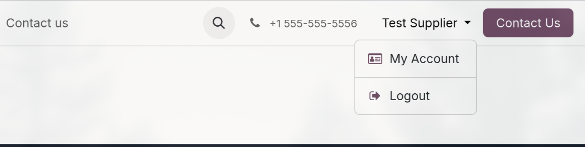
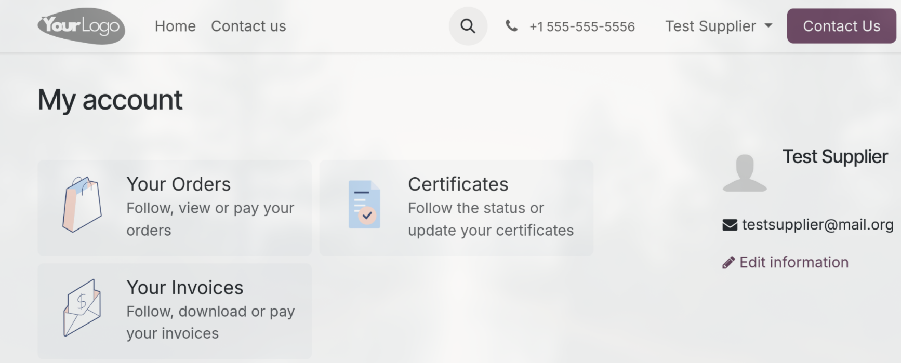
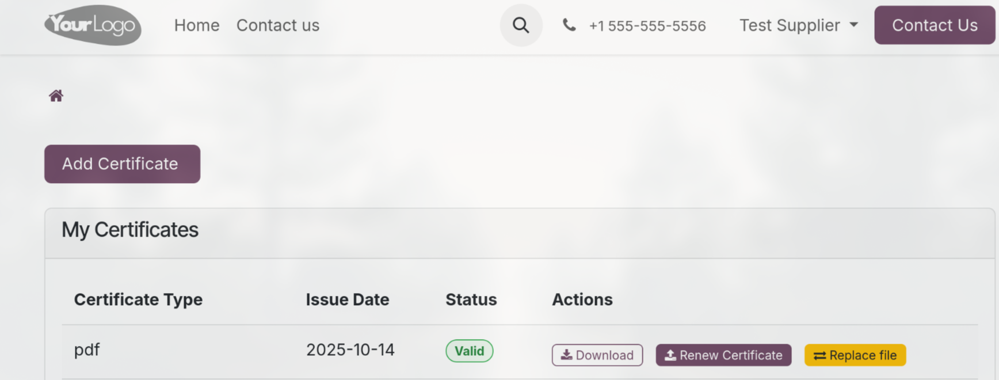
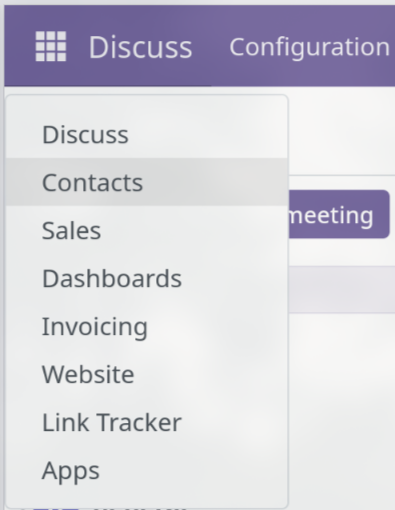
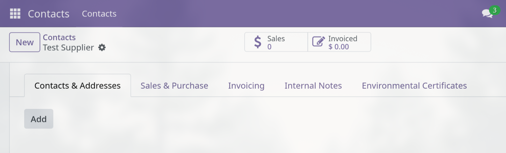
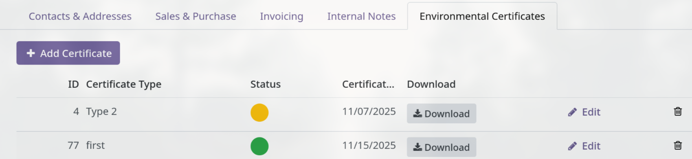

### Suppliers

To use this module, follow the link provided to you, then open the 'My account' page

then head to Certificates section

.

Here you can:

- Add your certificates to the portal
- Download them later
- Replace files if an error occurs
- Renew certificates when needed

### Purchase Managers And Administrators

Navigate to the Contacts section

here open an account of a supplier, then the Environmental Certificates page

.

Add new certificates, edit information for existing ones, check validity at a glance and delete the ones no longer needed, if you have administrator access rights.

